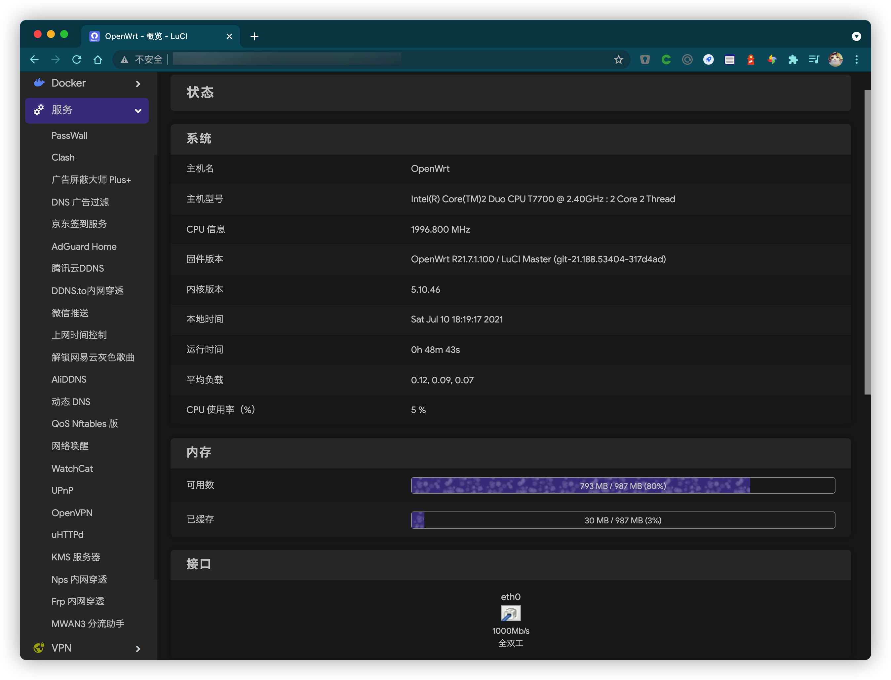
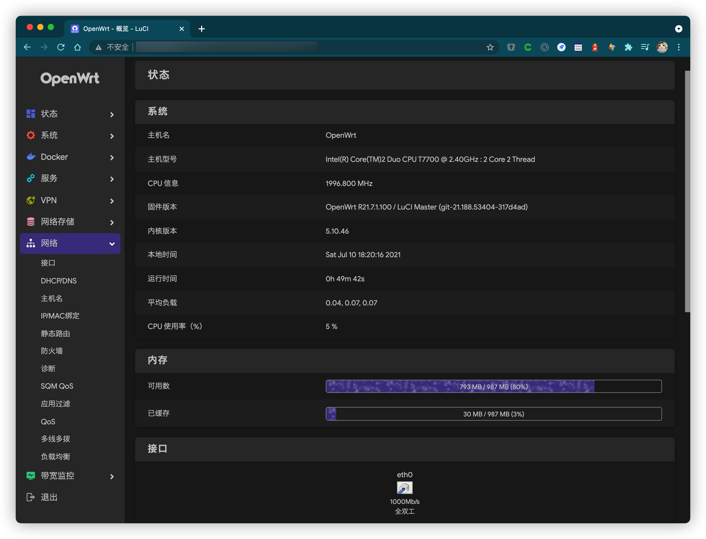

# Actions-OpenWrt

 

Auto Build OpenWrt for x86_64 （固件自动云编译）

## 固件特点

- X86_64 固件大小 832MB (squashfs+EXT4)
- 默认主题为 Argon ，除了对PassWall、Clash、AdGuardHome（广告拦截）、Appfilter（应用过滤）、ZeroTier 等热门插件的支持外，集成了常用的命令行工具如socat\iper3\curl\nano等便于自身维护。
- 默认 Lan IP: `192.168.199.1 ` 账号/密码 `root / password`
- 每半个月自动编译一次新固件，编译成功后支持微信通知/Telegram通知（需要在setting->secrets添加相应的值）已弃用server酱改用 pushplus 替代

## 截图

---

## 版权归属

感谢 [P3TERX](https://github.com/P3TERX/Actions-OpenWrt) 提供云编译模版，让个人固件定制成为一件相对轻松的事情。
